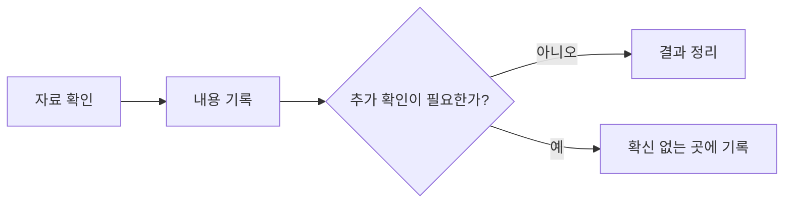

스터디 노트에서 사용하는 본문 요소가 화면 크기와 색상 모드에 관계없이 올바르게 표시되는지 확인한다. 아래 내용은 각 요소의 형태, 간격, 정렬을 점검하기 위한 예시다.

**노트는 블로그 글과 엄밀하게 구분한다.** 블로그 글이 하나의 주제를 완결된 흐름으로 전달하는 글이라면, 노트는 공부하는 과정에서 생긴 관찰, 임시 결론, 확인하지 못한 부분과 다음 할 일을 계속 갱신하는 기록이다. 따라서 노트에서는 매끄러운 서술보다 현재의 이해 상태가 명확하게 드러나는 것이 중요하다.

일반 문장 안에서는 **굵은 글씨**, *기울임*, ~~취소선~~, `inline code`를 사용할 수 있다. [Astro 공식 문서](https://docs.astro.build/)와 같은 외부 링크와 각주도 함께 확인한다.[^reference]

> 인용문은 본문과 구분되는 내용이나 다른 자료에서 가져온 문장을 표시할 때 사용한다.

## 목록

### 순서 없는 목록

- 첫 번째 항목
- 두 번째 항목
  - 중첩된 첫 번째 항목
  - 중첩된 두 번째 항목
- 세 번째 항목

### 순서 있는 목록

1. 자료를 확인한다.
2. 핵심 내용을 기록한다.
3. 확인이 필요한 부분을 따로 표시한다.

### 진행 상태

- [x] 기본 텍스트 스타일
- [x] 목록과 체크박스
- [x] 표와 코드 블록
- [ ] 모바일 화면 최종 확인

## 비교 표

| 요소 | 확인할 내용 | 예상 동작 |
| --- | --- | --- |
| 긴 문장 | 줄바꿈 | 본문 폭 안에서 자동 줄바꿈 |
| 표 | 가로 폭 | 좁은 화면에서 가로 스크롤 |
| 코드 | 공백과 줄바꿈 | 원래 형식을 유지 |
| 이미지 | 크기와 비율 | 본문 폭에 맞춰 축소 |

## 코드

짧은 값은 `status: working`처럼 문장 안에 표시한다.

```js
const note = {
  title: "첫 노트",
  status: "working",
  tags: ["test", "markdown"],
};

const isVisible = note.status !== "draft";
```

```css
.note-body {
  font-family: var(--font-mono);
  line-height: 1.55;
}
```

## Mermaid



## 이미지

아래 이미지는 로컬 SVG 에셋의 크기와 정렬을 확인하기 위한 예시다.


---

## 결과 문장

확인한 내용을 간단히 정리하는 영역이다. 제목과 본문은 포인트 컬러로 표시되며 별도의 세로선은 사용하지 않는다.

- 기본 본문 요소가 정상적으로 렌더링된다.
- 표와 코드는 좁은 화면에서 본문 영역을 벗어나지 않는다.
- 이미지는 원래 비율을 유지하며 본문 폭에 맞춰 표시된다.

## 확신 없는 곳

추가 검토가 필요하거나 아직 결론을 내리지 않은 내용을 기록하는 영역이다.

- 매우 긴 제목이 여러 줄로 표시될 때의 가독성
- 큰 Mermaid 도식의 모바일 화면 높이
- 실제 노트가 늘어난 뒤 목록에서 느껴지는 정보 밀도

## 참고 자료

출처나 본문 흐름을 끊는 보충 설명은 각주로 분리할 수 있다.

[^reference]: 각주는 본문 아래에 번호 목록으로 표시되며 참조 번호를 통해 원래 위치로 돌아갈 수 있다.
## 분포 그래프

정규분포의 오른쪽 기각역과 임계값을 확인한다.

```dist
kind: normal
mean: 0
sd: 1
shade: right 1.96
mark: 0, 1.96=임계값
xlabel: z
caption: 양측 검정 우측 기각역
```

자유도가 작은 t 분포와 표준정규분포의 꼬리 차이를 비교한다.

```dist
kind: t
df: 5
shade: outside -2.571 2.571
mark: -2.571, 2.571
xlabel: t
caption: 자유도 5인 t 분포와 정규분포
```

오른쪽으로 치우친 모식도에서 평균과 중앙값의 관계를 표시한다.

```dist
kind: skew-right
mean: 3
median: 2.4
caption: 오른쪽으로 치우친 분포
```

왼쪽으로 치우친 모식도에서도 두 통계량의 위치를 비교한다.

```dist
kind: skew-left
mean: -3
median: -2.4
caption: 왼쪽으로 치우친 분포
```

두 정규분포가 겹치는 영역을 확인한다.

```dist
kind: two-normal
mean: -0.8
sd: 1
mean2: 1
sd2: 1.25
mark: -0.8=집단 A, 1=집단 B
xlabel: 관측값
caption: 두 정규분포의 겹침
```

아래 블록은 잘못된 설정이 빌드를 중단하지 않고 원래 코드블록으로 남는지 검증한다.

```dist
kind: not-a-distribution
caption: 이 블록은 코드로 남아야 한다
```
