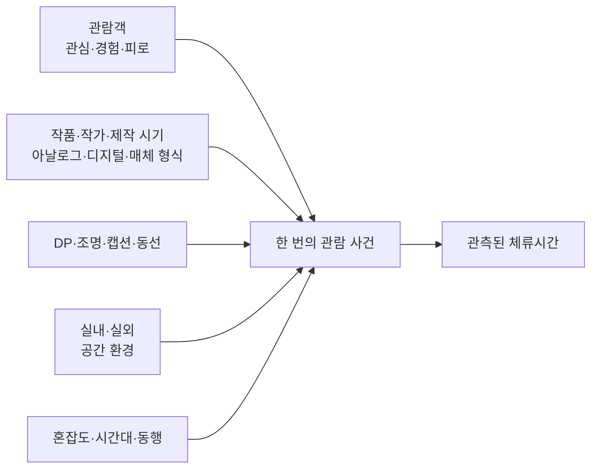

대학원에 진학하면 연구에 앞서 통계를 배워야 한다.
그런데 그림을 그려 대학에 들어갔고 학부에서도 통계를 다뤄본 적이 없는 나에게, HCI 데이터 분석과 통계는 생소할 수밖에 없다.
모르는 채로 연구를 시작하기보다 지금의 내가 이해할 수 있는 범위에서 기본 개념을 미리 정리해둘 필요를 느꼈다.
이 스터디 노트는 그 준비 과정의 첫 기록이다.

출발점으로는 내게 익숙한 전시 관람을 택했다. 

먼저 분명히 해둘 점이 있다. **내 연구 주제가 전시나 DP인 것은 아니다.** 전시 관람과 작품 앞 체류시간은 통계 개념을 구체적으로 이해하기 위해 이 글에서 빌려온 예시일 뿐이다.

미술관에서 한 사람이 작품 앞에 얼마나 오래 머무는지 기록한다고 해보자.
초 단위 숫자는 쉽게 얻을 수 있지만, 그 숫자가 무엇을 뜻하는지는 저절로 정해지지 않는다.

이 글에서 **DP**는 작품의 위치·간격·높이, 벽면, 조명, 캡션, 동선 등 **전시 연출 조건**을 뜻한다.
작품 앞 체류시간 사례를 따라 데이터와 통계의 기본 순서를 익혀보고자 한다.


---


## 질문

* 쓱 보고 지나간 사람은 0초인가, 데이터에서 빼야 하는가?
* 작품, 작가의 유명세, 제작 시기, DP 중 무엇이 체류시간을 바꿨는가?
* 작품이 바뀌어도 체류시간이 비슷하면 공간의 힘이라고 볼 수 있는가?
* 작품마다 DP의 효과가 다르면 이것이 상호작용인가?

> 먼저 분포를 보고, 그다음 평균을 본다. 차이를 발견한 뒤에는 설계를 보고, 설계가 허용하는 범위까지만 해석한다.


---


## 1. 체류시간은 몰입 그 자체가 아니다

체류시간은 관찰할 수 있는 행동이다.
몰입, 관심, 감동, 작품성은 직접 보이지 않는 개념이다.
오래 머물렀다고 반드시 깊이 몰입한 것도 아니고, 짧게 보았다고 작품이 나쁜 것도 아니다.



필자인 나는 평소 전시 관람을 선호하는 편이 아니다.
그런 내가 전시를 예로 든다는 점은 조금 아이러니하다.
그럼에도 내게 전시 공간은 어린 시절부터 가장 자주 접해온 장면이고, 좋아해서라기보다 구체적으로 떠올리고 질문할 수 있다는 점에서 내게 가장 익숙한 사례다.
나는 대부분의 작품을 쓱 보고 넘어가므로 기본 체류시간도 짧은 편이다.
하지만 좋아하는 작가의 작품, 관심 있는 주제의 기획전, 친한 친구의 전시라면 더 오래 머문다.

여기에 더해 체류시간에 영향을 줄 수 있는 요인은 개인의 관심뿐 아니라 주의와 상황에도 걸쳐 있다.

| 요인 유형       | 이 사례에서의 예                         | 따로 측정할 수 있는 것           |
| ----------- | --------------------------------- | ----------------------- |
| 작가·작품 선호    | 반 고흐를 좋아함                         | 작가 사전 인지도, 선호도          |
| 주제·형식 친숙성   | 지브리 기획전에 관심이 있음                   | IP·주제 친숙도, 방문 목적        |
| 사회적 관계      | 친한 친구가 참여한 전시                     | 작가와의 관계, 초대 여부          |
| 전시 관람 성향    | 평소 전시를 빠르게 보는 편                   | 전시 방문 빈도, 평소 관람 방식      |
| 시각적 두드러짐    | 거대한 미디어아트, 움직이는 조형물, 벽면을 채운 대형 회화 | 크기·움직임·대비, 시야에서 차지하는 비율 |
| 사회적 단서·군중효과 | 사람들이 몰린 작품을 따라 보거나 중요하다고 여김       | 주변 인원, 대기열, 집단의 체류와 행동  |

따라서 체류시간이 길어졌다는 결과만 보고 “몰입이 높았다”고 하나로 묶을 수 없다.
개인의 관심인지, 외부 자극에 의한 것인지, 주변 사람에게서 얻은 사회적 단서인지 연구 전에 구분하고 별도 변수로 측정해야 한다.
사람의 시선은 움직임, 거대함, 강한 대비처럼 주변에서 두드러진 자극에 빠르게 포착될 수 있다.
야외의 거대한 미디어아트, 움직이는 조형물, 층고가 높은 실내 한쪽 벽을 채운 대형 회화는 관람객이 해당 작가나 주제를 미리 선호하지 않았더라도 먼저 눈에 들어오거나 압도감을 줄 수 있다.
다만 “시선을 끌면 누구나 오래 본다”는 법칙은 아니다.
실제 반응은 관람객이 놓인 환경과 개인차에 따라 달라진다.

이때 **시선이 먼저 끌린 것**과 **그 대상을 좋아하거나 알고 싶어 하는 관심**도 구분해야 한다.
주의 포획은 '멈춤 여부'를 바꿀 수 있고, 작가 선호나 주제 관심은 멈춘 뒤의 '체류시간'을 바꿀 수 있다.
따라서 작품의 물리적 크기, 움직임, 밝기·대비와 시야에서 차지하는 비율도 함께 기록할 가치가 있다.

다른 관람객의 행동도 하나의 사회적 단서가 된다.
특정 작품에 사람이 몰리면 “볼 만한 이유가 있나 보다”라고 판단해 멈추거나 대기하면서 체류시간이 길어질 수 있다. 반대로 혼잡해서 작품이 잘 보이지 않거나 불편하면 빨리 떠날 수도 있다. 더구나 사람들이 오래 머물러 군중이 생긴 것인지, 군중을 보고 새 관람객이 오래 머문 것인지 관찰 자료만으로는 방향을 구분하기 어렵다.

그래서 단순 인원수뿐 아니라 도착 시점의 주변 인원, 대기 여부, 작품의 가시성, 앞선 관람객의 행동을 시간 순서와 함께 기록하는 편이 좋다. 같은 사람도 작품과 상황에 따라 달라지므로 개인의 기본 성향과 특정 전시에 대한 관심을 함께 기록하는 편이 좋다. 

관심뿐 아니라 **무엇을 어디에서 보았는가**도 나눠 기록해야 한다.
실내와 실외는 조도, 날씨, 소음, 이동 속도와 머물 수 있는 조건이 다르다.
작품이 아날로그인지 디지털인지, 아날로그라면 평면인지 입체인지, 디지털이라면 미디어아트·인터랙티브·영상 중 무엇인지에 따라서도 예상 관람 방식이 달라진다.

| 구분할 변수     | 가능한 값의 예         | 체류시간과 함께 볼 이유           |
| ---------- | ---------------- | ----------------------- |
| 공간 환경      | 실내, 실외, 반실외      | 날씨·조도·소음·이동 조건이 다름      |
| 작품 형식      | 아날로그, 디지털        | 접근 방식과 관람 행위가 다름        |
| 아날로그 세부 형식 | 평면, 입체, 설치       | 볼 수 있는 면과 이동 범위가 다름     |
| 디지털 세부 형식  | 미디어아트, 영상, 인터랙티브 | 재생 시간과 참여 절차가 체류시간을 제한함 |

예를 들어 10분짜리 영상 앞의 3분과 한 점의 회화 앞의 3분은 같은 숫자여도 같은 관람 경험이라고 단정하기 어렵다.
이 변수들은 DP와 상호작용할 수도 있지만 DP 자체와 동일한 것은 아니다.
한 번의 관람에는 여러 요인이 함께 작용한다.
체류시간은 몰입을 이해하는 **하나의 지표**이지 몰입 그 자체가 아니다.

| 구분     | 뜻                       | 예                                                      |
| ------ | ----------------------- | ------------------------------------------------------ |
| 구성개념   | 직접 보이지 않아 이론적으로 정의하는 대상 | 몰입, 관심                                                 |
| 지표     | 구성개념을 알아보기 위해 관찰하는 신호   | 체류시간, 시선, 회상 응답                                        |
| 조작적 정의 | 실제로 무엇을 어떻게 잴지 정한 규칙    | 작품 앞의 관찰 구역에서 이동을 멈추고 작품을 관람한 시간(초). 멈추지 않고 통과한 경우는 0초 |

관찰 구역, 타이머의 시작과 종료, 재입장 처리도 연구 전에 정한다.

| 기록      | 뜻                          | 기본 처리        |
| ------- | -------------------------- | ------------ |
| 0초      | 관찰 구역을 통과했지만 작품 앞에서 멈추지 않음 | 관찰된 행동으로 남김  |
| 짧은 관람   | 잠시 멈추거나 빠르게 살펴봄            | 정한 규칙대로 기록   |
| 매우 긴 관람 | 장기 관람, 대화, 대기 또는 오류일 수 있음  | 맥락과 원자료 확인   |
| NA      | 가림, 장비 오류 등으로 측정하지 못함      | 결측 사유와 함께 남김 |

0초는 관찰한 행동이고 NA는 측정하지 못해 모르는 값이다.
멈춘 사람만 남기면 체류시간이 실제보다 길어질 수 있다.
긴 값도 무조건 삭제하지 말고 오류인지 실제 사례인지 확인하여야 한다.


---


## 2. 관측 단위와 데이터 구조

**관람객 한 명이 작품 하나를 한 번 마주친 사건**을 한 행으로 두자.
한 사람이 작품 A와 B를 보았다면 두 행이 생긴다.

| visitor_id | artwork_id | dp   | time_sec | nearby_people | stopped |
| ---------- | ---------- | ---- | -------- | ------------- | ------- |
| V01        | A          | DP 1 | 0        | 2             | 아니요     |
| V02        | A          | DP 1 | 2        | 3             | 예       |
| V03        | A          | DP 1 | 4        | 1             | 예       |
| V04        | A          | DP 1 | 29       | 6             | 예       |
| V05        | A          | DP 1 | 160      | 1             | 예       |

같은 관람객이 다른 작품을 보면 행이 늘어난다. 예를 들어 V02가 이후 작품 B를 DP 2에서 24초 관람했다면 여섯 번째 행이 생긴다.

| visitor_id | artwork_id | dp   | time_sec | nearby_people | stopped |
| ---------- | ---------- | ---- | -------- | ------------- | ------- |
| V02        | B          | DP 2 | 24       | 4             | 예       |

\*아래 3장에서는 작품 A · DP 1의 다섯 행을 사용한다. 4장에서는 비교를 위해 작품 A · DP 2의 다섯 관람값을 추가하고, 5장에서는 두 묶음을 함께 사용해 작품과 DP의 효과를 살펴본다.

`nearby_people`는 관람객이 **관찰 구역에 진입한 시점**에 미리 정한 작품 주변 구역 안에 있던 **다른 관람객 수**다. 기준 관람객 본인은 제외한다. 진입 시점을 기준으로 삼으므로 멈추지 않고 통과한 0초 행에도 같은 규칙이 적용된다.
이 다섯 행의 `time_sec` 값은 3장과 5장에서 그대로 사용한다.

| 용어    | 질문                 | 예                                 |
| ----- | ------------------ | --------------------------------- |
| 관측 단위 | 무엇 하나를 사례로 세는가?    | 한 사람×한 작품×한 번의 만남                 |
| 관측    | 실제로 기록된 한 사례는?     | V04가 A를 DP 1에서 29초 봄              |
| 변수    | 사례마다 달라지는 항목은?     | `time_sec`, `nearby_people`, `dp` |
| 값     | 한 사례에서 변수가 가진 내용은? | `time_sec = 29`                   |

| 데이터 수준 | 정보                                               | 반복되는 위치     |
| ------ | ------------------------------------------------ | ----------- |
| 관람객    | 연령대, 사전 관심, 방문 경험                                | 그 사람의 여러 사건 |
| 작품     | 작가, 제작 시기, 아날로그·디지털, 평면·입체·미디어아트 등 세부 형식, 유명세 지표 | 여러 관람객의 행   |
| 설치·공간  | 실내·실외 환경, DP, 벽면, 조명, 캡션, 벤치, 동선                 | 같은 설치의 여러 행 |
| 관람 사건  | 체류시간, 혼잡도, 시간대, 동행, 순서                           | 행마다 새로 기록   |

같은 관람객이나 작품에서 나온 행들은 서로 닮을 수 있다.
행 수를 독립적인 사람 수로 착각하면 안 된다.


---


## 3. 평균보다 먼저 분포를 보자

가상의 체류시간은 0, 2, 4, 29, 160초다.

| 요약    | 값      |
| ----- | ------ |
| 표본 크기 | n = 5  |
| 평균    | 39초    |
| 중앙값   | 4초     |
| 범위    | 0–160초 |

```dist
kind: skew-right
mean: 39
median: 4
data: 0, 2, 4, 29, 160
xlabel: 작품 앞 체류시간(초)
caption: 곡선은 오른쪽 치우침의 개념도다. 축 아래 원자료 점은 중앙값 4와 평균 39의 표시선에 맞춰 구간별로 배치했다
```

```dist
kind: normal
mean: 39
sd: 12
xlabel: 작품 앞 체류시간(초)
caption: 비교용 개념도: 평균을 중심으로 좌우가 대칭인 분포
```

이처럼 관측값 대부분은 작은 값 근처에 모여 있는데 소수의 큰 값이 오른쪽으로 길게 꼬리 형태로 이어지는 모양을 **오른쪽으로 치우친 분포**라고 한다.
**꼬리**는 값이 드문 쪽으로 분포가 가늘고 길게 이어지는 부분을 가리킨다.

체류시간에서 이런 모양이 생길 수 있는 이유도 어렵지 않다.
많은 사람은 작품을 보지 않고 지나가거나 잠깐만 멈추지만, 일부는 캡션을 읽고 동행자와 대화하거나 오디오가이드를 끝까지 들으면서 훨씬 오래 머물 수 있다.
체류시간에는 0이라는 분명한 하한이 있지만, 긴 값 쪽으로는 관찰 범위 안에서 훨씬 넓게 벌어질 수 있다.

평균은 극단값의 영향을 받는다.
중앙값은 순위의 가운데다.
체류시간에는 0이라는 아래 경계와 긴 오른쪽 꼬리가 생길 수 있다.

평균 하나만 말하지 않는다.
**0초 비율, 중앙값, IQR[^iqr], 평균, SD와 실제 분포**를 함께 본다.

위의 매끈한 곡선은 **개념도**다.
다섯 명에게서 실제로 매끈한 분포를 관측한 것처럼 제시하여서는 안될 것이다.


---


## 4. 표준편차

이번 가상 체류 값은 29, 33, 38, 44, 51초다.

| 요약     | 값      |
| ------ | ------ |
| 평균     | 39초    |
| 모집단 SD | 약 7.8초 |
| 표본 SD  | 약 8.7초 |

표준편차(SD)는 값들이 평균 주변에서 얼마나 흩어졌는지를 원래 단위로 요약한다.

1. 각 값에서 평균을 뺀다.
2. 편차를 제곱한다.
3. 편차 제곱합을 목적에 따라 n 또는 n−1로 나눈 뒤 제곱근을 취한다.

평균 39초에서 각 값을 뺀 편차는 −10, −6, −1, 5, 12이고, 편차 제곱합은 100 + 36 + 1 + 25 + 144 = 306이다.

| 구분     | 계산식                    | 결과     |
| ------ | ---------------------- | ------ |
| 모집단 SD | √(306 ÷ 5) = √61.2     | 약 7.8초 |
| 표본 SD  | √(306 ÷ (5−1)) = √76.5 | 약 8.7초 |

모집단 SD는 이 다섯 명 자체의 퍼짐을 기술할 때 분모에 n을 쓴다.
표본 SD는 다섯 명을 더 큰 모집단에서 뽑은 표본으로 보고 모집단의 퍼짐을 추정하므로 분모에 n−1을 쓴다. (n−1에 대한 설명은 다음 장에서 다루도록 하겠다.)

표준편차를 구했으면 이제 그 값으로 무엇을 말할 수 있는지 정해야 한다. 정규분포에서는 값의 약 68%가 평균 ±1 SD 안에 들어온다. 이를 68% 규칙 또는 경험 규칙이라고 한다. 평균 39초, 표본 SD 8.7초라면 30.3초부터 47.7초 사이에 약 68%가 있을 것으로 예상한다.

```dist
kind: normal
mean: 39
sd: 8.7
shade: between 30.3 47.7
mark: 30.3=−1 SD · 30.3초, 47.7=+1 SD · 47.7초
data: 29, 33, 38, 44, 51
xlabel: 작품 앞 체류시간(초)
caption: 점은 다섯 관측값이며, 음영은 정규분포를 가정한 평균 ±1 SD 범위다
```

**68% 규칙은 정규분포에 가까울 때만 적용된다.**
이 작은 표본에서는 5개 중 33·38·44초 세 값만 음영 안에 있다. 68%는 이 다섯 점에서 정확히 맞아야 하는 비율이 아니라 정규분포를 반복 관측할 때의 이론적 비율이다.
치우친 체류시간에 기계적으로 적용하면 안 된다.


---


## 5. 작품의 힘과 공간의 힘

이제 3번과 4번의 관람값을 버리지 않고 같은 연구의 다음 단계로 가져오자. 두 묶음은 같은 작품 A를 서로 다른 DP에서 본, **각 조건의 서로 다른 관람객 5명씩**의 기록이라고 가정한다.

| 조건          | 다섯 관람값              | 평균  | 표본 SD   |
| ----------- | ------------------- | --- | ------- |
| 작품 A · DP 1 | 0, 2, 4, 29, 160초   | 39초 | 약 68.7초 |
| 작품 A · DP 2 | 29, 33, 38, 44, 51초 | 39초 | 약 8.7초  |

앞에서 본 바로 그 값들이다. A의 평균은 두 DP에서 모두 39초지만 관람 양상은 전혀 다르다. DP 1에서는 세 사람이 거의 멈추지 않았고(0·2·4초), 한 사람이 잠깐 멈췄으며(29초), 한 사람이 160초를 머물렀다. 반면 DP 2에서는 다섯 사람이 평균 주변에 비교적 가깝게 모였다.

**왜 5가 아니라 4로 나눌까: 작품 A · DP 1의 임시 기준선**

우리가 알고 싶은 기준은 앞으로 이 전시를 볼 더 큰 관람객 집단의 실제 평균이다. 하지만 지금 손에 있는 것은 작품 A를 DP 1에서 본 다섯 명의 기록뿐이다. 실제 평균을 모르므로 다섯 기록의 평균인 39초를 **임시 기준선**으로 삼는다.


39초는 임의로 고른 숫자가 아니다. 같은 다섯 기록에서 평균과의 거리제곱합이 가장 작아지는 위치다.

| 임시 기준선         | 0, 2, 4, 29, 160초와의 거리제곱합 |
| -------------- | ------------------------- |
| 30초            | 19,261                    |
| 35초            | 18,936                    |
| **39초 — 표본평균** | **18,856 — 가장 작음**        |
| 45초            | 19,036                    |
| 50초            | 19,461                    |

같은 기록에 가장 잘 맞도록 기준선을 정했으니, 그 선에서 잰 퍼짐은 더 큰 관람객 집단의 퍼짐을 작게 추정하는 경향이 있다. 이를 보정하기 위해 거리제곱합을 5가 아니라 5−1, 즉 4로 나눈다.

| 계산              | 결과      |
| --------------- | ------- |
| 18,856 ÷ 5의 제곱근 | 약 61.4초 |
| 18,856 ÷ 4의 제곱근 | 약 68.7초 |

왜 정확히 4일까? 다섯 기록으로 평균이라는 기준선 하나를 정하는 데 정보 한 몫을 사용했기 때문이다. 평균이 정해지면 다섯 편차의 합은 반드시 0이어서, 네 편차를 알면 마지막 편차는 자동으로 정해진다. 이를 **자유도가 4**라고 한다. 관람객 한 명을 버린다는 뜻은 아니다. 더 엄밀하게는 같은 방식으로 표본을 반복해서 뽑을 때 n−1로 나눈 **분산**이 모집단 분산을 평균적으로 정확히 추정하도록 하는 보정이다.

A · DP 1의 표본 SD는 이렇게 약 68.7초가 된다. A · DP 2도 같은 순서로 계산한다. 평균과의 차이를 제곱해 더한 값 306을 4로 나누고 제곱근을 구하면 약 8.7초다.

이렇게 계산한 두 표본 SD를 실제 관측값과 함께 확인해보자. 두 조건은 평균이 모두 39초지만, 표본 SD는 약 68.7초와 8.7초로 거의 8배 차이가 난다. 아래 점들은 평균만으로는 보이지 않는 차이를 숫자 그대로 보여준다.

<figure class="note-observation-compare">
  <svg viewBox="0 0 640 175" xmlns="http://www.w3.org/2000/svg" role="img" aria-label="작품 A의 DP 1과 DP 2 관람값을 같은 0초에서 160초 눈금에 찍은 비교">
    <line x1="80" y1="52" x2="624" y2="52" stroke="var(--line)" />
    <line x1="80" y1="106" x2="624" y2="106" stroke="var(--line)" />
    <line x1="212.6" y1="20" x2="212.6" y2="126" stroke="var(--accent)" stroke-dasharray="3 4" />
    <text x="212.6" y="13" fill="var(--accent)" font-family="var(--font-mono)" font-size="10" text-anchor="middle">공통 평균 39초</text>
    <text x="16" y="56" fill="var(--muted)" font-family="var(--font-mono)" font-size="10">A · DP 1</text>
    <text x="16" y="110" fill="var(--muted)" font-family="var(--font-mono)" font-size="10">A · DP 2</text>
    <g fill="var(--accent)">
      <circle cx="80" cy="52" r="3" /><circle cx="86.8" cy="52" r="3" /><circle cx="93.6" cy="52" r="3" /><circle cx="178.6" cy="52" r="3" /><circle cx="624" cy="52" r="3" />
    </g>
    <g fill="currentColor">
      <circle cx="178.6" cy="106" r="3" /><circle cx="192.2" cy="106" r="3" /><circle cx="209.2" cy="106" r="3" /><circle cx="229.6" cy="106" r="3" /><circle cx="253.4" cy="106" r="3" />
    </g>
    <g fill="var(--muted)" font-family="var(--font-mono)" font-size="9">
      <text x="77" y="40" text-anchor="end">0</text><text x="87" y="31" text-anchor="middle">2</text><text x="97" y="40" text-anchor="start">4</text><text x="178.6" y="40" text-anchor="middle">29</text><text x="624" y="40" text-anchor="end">160</text>
      <text x="178.6" y="95" text-anchor="middle">29</text><text x="192.2" y="121" text-anchor="middle">33</text><text x="209.2" y="95" text-anchor="middle">38</text><text x="229.6" y="121" text-anchor="middle">44</text><text x="253.4" y="95" text-anchor="middle">51</text>
      <text x="80" y="147">두 줄 모두 합계 195초 ÷ 5명 = 평균 39초</text>
      <text x="624" y="166" text-anchor="end">작품 앞 체류시간(초)</text>
    </g>
  </svg>
  <figcaption>같은 평균의 다른 모습: DP 1은 160초 한 점이 평균을 끌어올리고, DP 2는 다섯 점이 평균 주변에 모여 있다.</figcaption>
</figure>

```dist
kind: two-normal
mean: 0
sd: 68.7
mean2: 0
sd2: 8.7
label: A · DP 1
label2: A · DP 2
mark: 0=공통 평균
xlabel: 공통 평균에서 떨어진 정도(초)
caption: 실제 분포를 추정한 곡선이 아니라, 같은 평균을 중심으로 두 표본 SD의 크기만 비교한 폭 모식도
```

가로축의 0은 체류시간 0초가 아니라 두 조건의 공통 평균인 39초를 뜻한다. −20초는 실제 체류시간이 음수라는 뜻이 아니라 평균보다 20초 짧다는 뜻이고, +20초는 평균보다 20초 길다는 뜻이다.

이 그림은 두 조건이 실제로 정규분포를 따른다고 가정한 결과가 아니다. 서로 다른 표본 SD를 같은 모양의 곡선 폭으로 바꾸어 비교한 모식도다. A · DP 1의 실제 다섯 값은 오른쪽으로 심하게 치우쳤으므로, 실제 관측값은 바로 위의 점 그림에서 확인해야 한다. 여기서는 두 조건의 평균이 같더라도 값들이 평균에서 떨어진 정도는 크게 다를 수 있다는 점만 읽는다.

따라서 작품 A에서 DP에 따른 평균 차이가 0초라는 말은 두 조건의 관람 행동이 완전히 같았다는 뜻이 아니다. 평균은 같아도 관측값의 퍼짐과 분포는 달라질 수 있다. 다만 이후의 작품×DP 비교에서는 설명을 단순화하기 위해 평균 체류시간의 상호작용만 살펴본다.

지금까지는 작품 A 하나를 두 DP에서 비교했다. DP에 따른 평균 차이가 작품마다 달라지는지 살펴보려면 나머지 두 칸이 더 필요하다. 작품 B를 본 관람객 5명의 가상 기록을 다음처럼 보탠다. 이것은 새 예시가 아니라 같은 작품×DP 표의 빈칸을 채우는 자료다.

| 조건          | 다섯 관람값              | 평균  | 표본 SD  |
| ----------- | ------------------- | --- | ------ |
| 작품 B · DP 1 | 10, 12, 14, 16, 18초 | 14초 | 약 3.2초 |
| 작품 B · DP 2 | 20, 22, 24, 26, 28초 | 24초 | 약 3.2초 |

네 조건의 관람객 수가 모두 5명으로 같으므로 조건 평균을 같은 비중으로 비교할 수 있다.

| 작품     | DP 1 평균 | DP 2 평균 | DP 변화에 따른 차이 |
| ------ | ------- | ------- | ------------ |
| A      | 39초     | 39초     | 0초           |
| B      | 14초     | 24초     | +10초         |
| DP별 평균 | 26.5초   | 31.5초   | +5초          |

* **작품의 주효과:** A의 전체 평균은 39초, B는 19초다. 이 자료에서는 A가 평균 20초 길다.
* **DP의 주효과:** DP 2의 전체 평균은 31.5초, DP 1은 26.5초다. 이 자료에서는 DP 2가 평균 5초 길다.
* **작품×DP 상호작용:** A에서는 DP가 바뀌어도 평균 차이가 0초지만, B에서는 +10초다.
* **차이의 차이:** (39−39)−(24−14)=−10초다. 부호는 비교 순서를 나타내고, 두 DP 효과가 서로 다른 크기는 10초다.

상호작용은 한 요인의 효과가 다른 요인에 따라 달라진다는 뜻이다. 여기서는 “DP 2가 항상 5초 늘린다”가 아니라 작품 A에서는 평균이 그대로이고 작품 B에서는 10초 늘어난다.

상호작용 패턴이 보이면 DP의 평균 주효과 5초만으로는 충분하지 않다. 그러나 이 값 자체가 잘못된 것은 아니다. 작품 A에서의 평균 차이 0초와 작품 B에서의 평균 차이 10초를 같은 비중으로 평균낸 값이므로, “이 두 작품에서는 DP 2의 평균 체류시간이 DP 1보다 평균적으로 5초 길었다”고 해석할 수 있다. 다만 이를 “모든 작품에서 DP 2가 체류시간을 5초 늘린다”고 일반화해서는 안 된다. 따라서 평균 주효과와 작품별 조건 효과를 함께 보고해야 한다. 7장에서는 이 평균 주효과 5초를 그대로 이어받아 추정의 불확실성을 살펴본다.

* 여러 작품이 같은 DP에서 비슷한 분포를 보이면 공간 수준 요인이 공통으로 작용했을 가능성이 있다.
* 작품을 바꾸었을 때 분포가 달라지면 작품·작가·제작 시기 관련 요인을 의심할 수 있다.
* DP 효과가 작품마다 다르면 작품×DP 상호작용 가능성이 있다.
* 이것만으로 DP의 인과효과를 확정할 수는 없다.
* 체류시간만으로 작품성이 높다고 판단할 수 없다.
* 유명세는 사전 인지도 설문이나 검색량처럼 별도 지표로 측정해야 한다.


---


## 6. 인과 해석과 연구설계

작품 A가 항상 DP 1에 있고 작품 B가 항상 DP 2에 있으면 작품과 공간 효과를 분리할 수 없다.
두 원인이 함께 바뀌어 효과를 구분할 수 없는 상태를 **교란**이라 한다.

* 같은 작품을 둘 이상의 DP 조건에 둔다.
* 각 DP 조건에 여러 작품을 배치한다.
* 설치 순서와 시간대를 균형화한다.
* 혼잡도, 캡션, 조명, 벤치, 관람 순서를 기록하거나 통제한다.
* 여러 작가와 제작 시기의 작품을 포함한다.
* 실내·실외와 작품 형식을 기록하고, 형식이 다른 조건은 구분해 비교한다.
* 가능하면 관람객이나 경로를 조건에 무작위 배정한다.

관찰연구라면 “DP가 늘렸다”보다 **“DP와 체류시간이 관련되었다”**고 쓴다.

한 관람객이 여러 작품을 보면 그 행들은 닮을 수 있다.
한 작품을 여러 사람이 보아도 그 행들은 닮을 수 있다.
이것이 반복측정의 직관이다.

A와 B 자체만 비교할 때는 `작품 * DP`를 고정된 비교로 둘 수 있다.
여러 작품으로 일반화하려면 작품마다 기본 체류시간과 DP 효과가 다를 수 있게 둔다. 단, 작품별 DP 효과를 추정하려면 같은 작품이 여러 DP 조건에 놓여야 하고 작품 수도 충분해야 한다.

`체류시간 ~ DP + 유명세 + 제작시기 + 혼잡도 + 관람순서 + (1|관람객) + (1 + DP|작품)`

식을 외울 필요는 없다.
같은 관람객과 작품에서 나온 행들이 완전히 독립적이지 않다는 점이 핵심이다.

0초가 많다면 질문을 둘로 나눈다.

1. 작품 앞에 멈추었는가?
2. 멈춘 사람은 얼마나 오래 머물렀는가?

이를 **2부분 모형** 또는 **hurdle model**이라고 한다.


---


## 7. 표본에서 모집단으로

표본으로 모집단을 말할 때는 불확실성을 함께 보여준다.

| 용어   | 답하는 질문                                                   | 뜻               |
| ---- | -------------------------------------------------------- | --------------- |
| SD   | 개별 체류시간은 얼마나 흩어졌나?                                       | 관측값의 퍼짐         |
| 표준오차 | 다시 표집하면 추정값이 얼마나 흔들리나?                                   | 추정량의 표집 변동      |
| 신뢰구간 | 어떤 효과 범위가 데이터와 양립하는가?                                    | 크기와 불확실성        |
| 효과크기 | 차이가 실제로 얼마나 큰가?                                          | 초 단위 또는 표준화된 차이 |
| p값   | 귀무가설과 통계모형의 가정이 맞을 때, 관측된 것과 같거나 더 극단적인 결과가 나올 확률은 얼마인가? | 보조적인 불일치 정보     |

앞의 네 조건에서 두 작품에 같은 비중을 둔 평균 DP 효과는 5초였다.

* 작품 A의 평균 DP 효과: 39−39 = 0초
* 작품 B의 평균 DP 효과: 24−14 = 10초
* 두 작품의 평균 DP 효과: (0+10)÷2 = 5초

이 5초는 표본에서 관측된 평균 차이다. 그러나 다른 관람객을 다시 관찰해도 비슷한 차이가 나타날지는 알 수 없다. 표본에서 모집단으로 나아가려면 이 추정값이 얼마나 흔들릴 수 있는지 함께 살펴봐야 한다.

여기서 모집단은 우선 **같은 두 작품과 같은 DP 조건을 앞으로 경험할 더 큰 관람객 집단**을 뜻한다. 작품 A와 B만으로 모든 작품에 일반화할 수는 없다.

계산을 단순화하기 위해 네 조건에는 서로 다른 관람객이 5명씩 참여해 총 20명의 관측값이 있다고 가정한다. 이 경우 평균 DP 효과의 표준오차는 네 조건의 표본분산과 표본 크기를 함께 사용해 다음처럼 구할 수 있다.

`SE = ½ × √(68.7²÷5 + 8.7²÷5 + 3.2²÷5 + 3.2²÷5) ≈ 15.5초`

앞의 ½은 작품 A와 B의 DP 효과를 같은 비중으로 평균냈기 때문에 붙는다.

평균 DP 효과의 점추정값은 5초지만, 정규근사 95% 신뢰구간은 다음처럼 매우 넓다.

`5 ± 1.96×15.5 ≈ −25.4–35.4초`

```dist
kind: normal
mean: 5
sd: 15.5
shade: between -25.4 35.4
mark: -25.4=하한, 5=추정값, 35.4=상한
xlabel: 반복 표집에서 얻을 수 있는 평균 DP 효과 추정값(초)
caption: 평균 DP 효과의 점추정값은 5초지만, 작은 표본과 큰 퍼짐 때문에 추정의 불확실성은 매우 넓다
```

이 구간은 0초를 포함한다. 따라서 이 작은 표본만으로는 DP 2의 평균 체류시간이 더 길다고 효과의 방향을 확정하기 어렵다. 그렇다고 DP 효과가 정확히 0초임이 입증된 것도 아니다. 추정 가능한 범위가 넓다는 뜻이다.

이 계산은 네 조건을 서로 독립적인 집단으로 취급한 입문용 정규근사다. 특히 작품 A · DP 1에는 160초라는 긴 관측값이 있어 표준오차와 신뢰구간이 크게 넓어졌다. 실제 연구에서는 반복 관측, 오른쪽으로 치우친 분포와 0초 관측을 반영한 모형을 사용해야 한다.

* 95% 신뢰구간은 참값이 95% 확률로 이 안에 있다는 단순한 뜻이 아니다.
* 같은 절차를 반복하면 구간의 약 95%가 참값을 포함한다는 장기적 성질이다.
* 신뢰구간이 0을 포함한다고 효과가 없다고 입증된 것은 아니다.
* p값은 귀무가설이 참일 확률이 아니다.
* p값은 효과의 중요도를 말해주지 않는다.
* 효과크기와 신뢰구간을 먼저 보고 p값은 보조적으로 읽는다.


---


## 8. 실제 연구 순서

1. **질문을 쓴다.** 누구의 어떤 행동을 어떤 조건에서 비교할지 정한다.
2. **구성개념과 지표를 나눈다.** 몰입과 체류시간을 구분한다.
3. **관측 단위를 정한다.** 한 행은 사람×작품×한 사건이다.
4. **측정 규칙을 고정한다.** 구역, 시작·종료, 0초, 재방문, NA를 정의한다.
5. **설계를 교차한다.** 여러 작품을 여러 DP에 둔다.
6. **맥락을 기록한다.** 혼잡도, 조명, 캡션, 동행, 순서를 남긴다.
7. **원자료를 점검한다.** 오류와 결측 사유를 확인한다.
8. **분포부터 그린다.** 0초 비율, 중앙값, IQR, 평균, SD를 본다.
9. **설계와 분포에 맞는 모형을 쓴다.** 관람객과 작품의 반복, 0초가 많은 분포를 반영한다.
10. **허용된 범위로 해석한다.** 평균 주효과와 작품별 조건 효과를 구분하고, 효과크기와 불확실성을 함께 보고한다.

| 층   | 결과 문장 예시                                                                                     |
| --- | -------------------------------------------------------------------------------------------- |
| 관찰  | “표본에서 두 작품을 같은 비중으로 비교했을 때, DP 2의 평균 체류시간은 DP 1보다 5초 길었다.”                                   |
| 추론  | “평균 차이의 추정값은 5초였지만, 정규근사 95% 신뢰구간은 약 −25.4–35.4초로 넓었다.”                                      |
| 해석  | “표본에서는 DP 2의 체류시간이 길었지만, 작은 표본과 큰 퍼짐 때문에 효과의 방향과 크기는 아직 불확실하다. 체류시간만으로 몰입이나 작품성을 단정할 수도 없다.” |


---


## 참고 자료

* Yalowitz, S. S., & Bronnenkant, K. (2009). [Timing and Tracking: Unlocking Visitor Behavior](https://www.tandfonline.com/doi/full/10.1080/10645570902769134). *Visitor Studies, 12*(1), 47–64.
* Serrell, B. (1997). [Paying Attention](https://onlinelibrary.wiley.com/doi/abs/10.1111/j.2151-6952.1997.tb01292.x). *Curator, 40*(2), 108–125.
* Bitgood, S., & Patterson, D. (1993). [The Effects of Gallery Changes on Visitor Reading and Object Viewing Time](https://doi.org/10.1177/0013916593256006). *Environment and Behavior, 25*(6), 761–781.
* Hornbæk, K. (2013). [Some Whys and Hows of Experiments in HCI](https://researchprofiles.ku.dk/en/publications/some-whys-and-hows-of-experiments-in-humancomputer-interaction/).
* NIST/SEMATECH. [Measures of Scale](https://www.itl.nist.gov/div898/handbook/eda/section3/eda356.htm).
* NIST/SEMATECH. [Interaction Effects](https://www.itl.nist.gov/div898/handbook/pri/section6/pri613.htm).
* Wasserstein, R. L., & Lazar, N. A. (2016). [ASA Statement on p-Values](https://doi.org/10.1080/00031305.2016.1154108).

[^iqr]: IQR(사분위범위, interquartile range)은 데이터를 순서대로 놓았을 때 75% 지점인 제3사분위수(Q3)에서 25% 지점인 제1사분위수(Q1)를 뺀 값이다. 가운데 50%의 퍼짐을 나타내며, 극단값의 영향을 비교적 덜 받는다.
