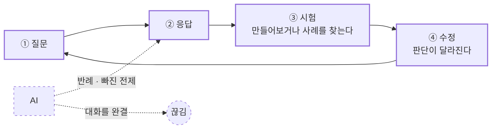
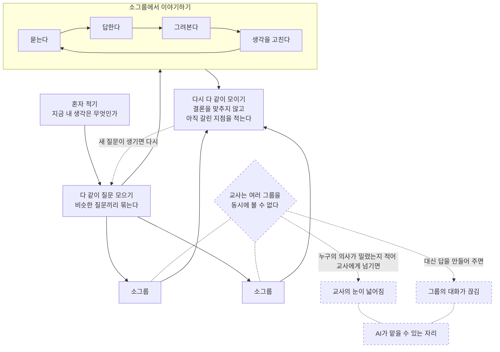

시리즈 01의 첫 글에서 내가 주목했던 것은 말을 잘하는 존재가 아니라 말하지 않는 존재였다.

토토로와 [[상상 속 친구의 수동성과 침묵|상상 속 친구]]는 아이의 질문에 즉시 답하지 않는다. 그 침묵 때문에 아이는 기다리고, 추측하고, 빈자리에 자기만의 의미를 넣는다. 나는 그때 상대가 수동적일수록 아이가 능동적이 될 수 있다고 썼다. AI가 아이의 곁에 들어올 때 지켜야 할 것도 이 능동성, 곧 아직 형성 중인 아이의 상상력과 [[아동의 주체성|주체성]]이라고 생각했다.

하지만 시리즈를 이어갈수록 '주체성'이라는 말은 계속 흔들렸다. [[아동의 상상력과 주체성에 관한 HCI 연구의 공백|국내 HCI 연구]]을 살펴보니 아이는 주로 학습 지원을 받거나 보호받는 사용자로 등장했고, 스스로 상상하고 해석하는 주체로는 좀처럼 보이지 않았다. 내가 경험한 미술영재교육을 돌아보면서는 [[미술영재교육의 다섯 가지 원칙|열린 과제, 과정의 기록, 질문으로 이루어진 피드백, 모호함을 견디는 일]]이 아이로 하여금 자기 생각을 읽게 했다는 사실을 다시 발견했다. 한편 아동용 AI의 안전을 검토하면서는 [[보호와 자율성|보호가 강해질수록 자율성이 줄어드는 역설]]과, 그 경계를 결정하는 좋은 어른의 역할도 피할 수 없었다.

스토리형 게임을 거치면서 질문은 조금 더 구체적으로 바뀌었다. 중요한 것은 선택지의 개수가 아니라 [[노력을 인정하고 되돌려주는 피드백|아이가 들인 노력이 세계 안에서 인정되고 되돌아오는가]]였다. 그러나 곧 이 설명도 충분하지 않다는 것을 알게 되었다. 시스템은 실제 의미 생성은 대신해버린 채 사용자에게 자신이 무언가 했다는 느낌만 정교하게 줄 수 있기 때문이다. 그래서 나는 [[행위성의 느낌과 노동|행위성의 느낌과 행위성의 노동]]을 구분했다. 아이에게 필요한 것은 결과를 소유했다는 감각만이 아니라, [[의미 생성의 노동|의미를 구성하고 가설을 세우고 규칙을 발견하는 몫]]이 실제로 남아 있는 환경이었다.

그 뒤의 글들은 그 노동이 일어나기 위한 조건을 좇았다. [[관계로서의 모호성과 해석의 허가|모호성]]은 사물 안에 저장된 장치가 아니라 아이와 대상 사이에서 생기는 관계였고, 아이에게는 먼저 [[관계로서의 모호성과 해석의 허가|"해석해도 된다"는 허가]]가 필요했다. [[낯섦의 소진과 목격자|낯섦]] 역시 처음부터 주입해둘 수 있는 속성이 아니었다. 익숙해진 것을 다른 자리에서 다시 보게 하는 간극, 그리고 아이가 미처 알아차리지 못한 그 간극을 되비추는 [[낯섦의 소진과 목격자|목격자]]가 필요했다. 결국 시리즈 01에서 내가 반복해서 묻고 있던 것은 아이에게 얼마나 많은 자유를 줄 것인가만이 아니었다.

아이가 질문하고, 해석하고, 이유를 만들고, 타인의 응답을 거쳐 자기 판단을 고치는 과정은 어떻게 남겨둘 수 있을까.

이렇게 다시 적고 보니 내가 의미를 만드는 노동이라고 불러온 것은 상당 부분 철학적 사고의 과정과 닮아 있었다. 그리고 어린이가 질문의 저자가 되어 다른 사람과 함께 그 질문을 검토하도록 수업을 조직해온 교육적 전통에는 이미 이름이 있었다. 바로 <strong>어린이 철학(Philosophy for Children, P4C)</strong>이다.

이 노트에서는 다섯 가지를 살펴보려 한다.

1. P4C는 정확히 무엇인가.
2. AI와의 대화를 탐구공동체라고 부를 수 있는가.
3. 어떤 질문과 답변이 탐구를 열고 닫는가.
4. 국내 미술영재교육에서 P4C가 실제로 사용된 적이 있는가.
5. 직접적인 사례가 드물다면, 이를 국내 미술영재교육의 맥락에서 어떻게 받아들일 수 있는가.

> 미리 밝혀둘 것이 있다. 이 글에서 P4C에 관한 서술은 대부분 개괄 자료와 2차 문헌에 기댄 것이다. 립먼의 원전을 직접 읽고 정리한 것이 아니므로, 개념의 세부는 이후 수정될 수 있다.

---

## P4C는 어린이에게 철학 지식을 가르치는 수업이 아니다

P4C는 1970년대 매슈 립먼(Matthew Lipman)과 동료들이 발전시킨 교육 운동이다. 이름만 보면 어린이에게 플라톤이나 칸트를 쉽게 설명하는 수업처럼 들리지만, 중심은 철학사의 전달이 아니다. 핵심은 교실을 <strong>[[철학적 탐구공동체|철학적 탐구공동체(community of philosophical inquiry)]]</strong>로 바꾸는 데 있다.

아이들은 이야기, 이미지, 사건이나 작품 같은 자극을 함께 접한다. 각자 그로부터 질문을 만들고, 함께 다룰 질문을 고른 뒤, 이유와 사례를 주고받으며 잠정적인 판단에 이른다. 교사는 정답을 전달하기보다 질문을 명료하게 하고, 근거를 요청하고, 서로 다른 발언이 연결되도록 돕는다. 탐구의 목표도 토론에서 이기는 것이 아니다. 자신의 생각을 더 분명하고 덜 모순되게 만들고, 다른 관점과 가치가 존재한다는 사실을 고려하면서 판단을 수정하는 데 있다.

이 구조에서 중요한 것은 아이가 말을 많이 했는지가 아니다. 아이의 생각이 공동의 검토를 견디며 변형될 기회를 가졌는가이다. 질문하기, 개념을 구분하기, 이유를 요구하기, 반례를 상상하기, 다른 사람의 관점을 이어받기, 자신의 판단을 바꾸기. P4C는 이런 행위를 비판적·창의적·배려적·협력적 사고가 함께 작동하는 과정으로 본다.

따라서 P4C는 내가 말해온 주체성을 조금 더 관찰 가능한 개념으로 바꾸어준다.

> 주체성은 아무 간섭 없이 혼자 선택하는 상태가 아니라, 자신의 해석을 제안하고 이유를 만들며 타인의 해석에 응답하고 필요하면 생각을 고칠 수 있는 능력일 수 있다.

여기서 주체성은 고립된 개인의 소유물이 아니다. 아이는 자신과 다른 경험을 가진 사람들의 질문과 반응을 거치며 자기 생각의 모양을 발견한다. 의미를 만드는 노동은 개인이 수행하지만, 그 판단은 타인과의 마찰 속에서 시험되고 수정된다.

---

## AI와의 대화를 탐구공동체라고 부를 수 있을까

위 소제목 질문에 나는 그렇지 않다고 생각한다. 적어도 P4C에서 말하는 탐구공동체와 같은 의미에서는 어렵다.

탐구공동체의 참여자들은 서로 다른 경험과 이해관계를 가지고 말한다. 각자는 자기 주장에 책임을 지고, 상대의 말에 영향을 받으며, 대화가 끝난 뒤에도 달라진 판단을 자신의 삶으로 가져간다. 반면 AI는 독립된 경험이나 이해관계를 가진 타자가 아니다. 학습 데이터와 운영 원칙을 바탕으로 그 순간에 적절해 보이는 응답을 구성하는 시스템이다.

별도의 페르소나가 주어지지 않은 AI는 대체로 안전하고 윤리적으로 수용 가능한 답을 만들려고 한다. 사용자의 말에 지나치게 동조하거나, 서로 충돌하는 문제를 무난한 문장으로 봉합할 수도 있다. 페르소나를 부여해 반대 입장을 말하게 하더라도 그것은 실제로 다른 삶에서 나온 관점이라기보다 설계자가 요청한 역할의 모사에 가깝다. 이때 아이는 타인과 판단을 만드는 대신, AI가 생성한 합리적인 대화의 모양을 소비하면서 공동으로 탐구했다는 느낌만 얻을 위험이 있다. 행위성의 노동 대신 행위성의 느낌만 남았던 앞선 문제와 같은 구조다.

그렇다고 AI가 철학적 탐구에 아무 역할도 할 수 없다는 뜻은 아니다. AI는 아이의 질문을 더 분명하게 다시 묻고, 빠진 전제를 짚고, 반례나 비교 사례를 제안하고, 여러 아이의 발언이 어떻게 이어졌는지 기록할 수 있다. 다만 AI가 대화를 매끄럽게 완결해서는 안 된다. AI가 만든 질문과 반례는 다시 아이와 아이, 아이와 교사, 서로 다른 삶을 가진 사람들 사이로 돌아가 검토되어야 한다.

따라서 [[AI는 탐구공동체의 구성원인가|AI는 탐구공동체의 대체 구성원이라기보다 공동체의 탐구를 실제 타인에게 되돌려 보내는 보조자]]에 가까워야 한다. 이 구분을 놓치면 P4C를 도입하면서도 정작 아이가 수행해야 할 철학적 노동을 AI에게 넘겨주는 모순에 빠질 수 있다.

---

## 탐구를 여는 질문과 답변

### 질문의 형식과 기능

**질문의 형식을 가졌다고 해서 모든 발화가 탐구를 여는 질문은 아니다.** 답을 들으려는 것이 아니라 상대를 세워두기 위해 던지는 비난, 교사가 원하는 답을 이미 알면서 확인하는 질문, 정해둔 결론을 승인받으려는 질문도 있다. 이런 발화는 답이 나와도 그 답을 다음 사고의 재료로 쓰지 않는다. 화자는 이미 결론을 가지고 있고, 응답자를 함께 판단할 상대가 아니라 자기 입장을 드러내기 위한 대상으로 둔다.

이 문제는 아이의 미숙함이나 일반 학급의 낮은 언어 능력만으로 설명할 수 없다. 국정감사 질의를 예로 들면 더 분명해진다. 국회의원들은 대체로 충분하거나 엘리트급의 고등 교육을 받았고 국민을 대표해 질문할 권한과 책임을 가진 어른들이다. 그럼에도 질문이 이미 정해둔 결론을 확인하거나 상대를 세워두기 위한 형식으로 닫혀 있는 경우가 적지 않다. 답변이 시작되어도 그 내용에는 관심을 두지 않은 채 다음 비난으로 넘어간다면, 의문문의 형태만 남았을 뿐 탐구는 일어나지 않는다.

여기에는 개인의 태도뿐 아니라 질문을 둘러싼 제도적 보상도 작용한다. 질의의 실제 청중이 눈앞의 답변자가 아니라 국민, 언론, 지지층이 될 때 질문은 새로운 사실을 알아내는 수단보다 자신의 입장을 공연하고 기록에 남기는 수단이 되기 쉽다. 질문자는 응답자와 함께 판단을 수정하기보다 짧고 강한 장면을 만드는 데 보상받는다. 충분히 배우고 말을 잘하는 사람일수록 질문의 외형을 더 정교하게 갖춘 채 대화를 닫을 수도 있다.

영재교육기관의 선발 절차 역시 질문의 배경지식과 형식적 완성도를 어느 정도 높일 수는 있어도, 답을 들을 준비나 자신의 판단을 수정할 태도까지 보장하지는 않는다. 따라서 이것은 영재와 일반 아동을 나누는 축이 아니라 탐구에 참여하는 태도, 발화의 목적, 그리고 질문을 둘러싼 환경의 보상 구조를 가르는 축이다.

탐구를 여는 질문은 화자가 무엇을 모르는지 드러내고, 예상하지 못한 답이 들어올 자리를 남긴다. 반대로 탐구를 닫는 질문은 결론을 질문의 꼴로 포장한다. 둘을 가르는 기준은 문장의 세련됨이 아니라 답 이후의 움직임이다. 상대의 답을 실제로 들었는가, 그 답으로 후속 질문이 달라졌는가, 어떤 답이 나온다면 자신의 판단을 고칠 수 있는가.

그렇다고 표현이 서툰 질문을 성급히 배제해서도 안 된다. 서툴지만 열려 있는 질문과 능숙하지만 닫혀 있는 질문은 다르다. 교사는 모든 질문을 좋은 질문이라고 칭찬하는 대신 “어떤 답을 들으면 네 생각이 달라질 수 있을까”, “방금 답에서 새로 알게 된 것은 무엇인가”, “이 질문은 상대를 이해하기 위한 것인가, 네 결론을 확인하기 위한 것인가”를 되물어 질문의 기능을 드러낼 수 있어야 한다. 반복적으로 누군가를 조롱하거나 세워두는 발화라면 탐구라는 이름으로 방치하지 않고 멈출 책임도 있다.

결국 탐구공동체가 보장해야 하는 것은 모든 질문의 동등한 가치가 아니라 질문하는 사람의 동등한 존엄이다. 질문은 검토되고 다시 쓰일 수 있다. 질문의 저자 자리를 돌려준다는 것은 아이가 처음 내놓은 모든 질문에 최종 권위를 부여하는 일이 아니라, 자신의 질문이 무엇을 열고 무엇을 닫는지 살피고 고칠 책임까지 돌려주는 일이어야 한다.

---

### 답변의 유창함과 응답성

같은 구분은 답변에도 적용되어야 한다. 답변의 질을 유창함만으로 판단하면, 질문에서는 경계했던 형식적 세련됨을 답변에서는 다시 좋은 사고의 증거로 받아들이게 된다. **논리가 정연한 듯하고 근거가 있어보이며 말이 매끄러워도 아무것도 열지 않는 답이 있다.** 국정감사에서 원론을 반복하는 답변처럼 문장에는 흠이 없지만 질문을 실제로 받아들이지 않고 다음 질문이 생길 자리도 남기지 않는 경우다.

**유창함과 구별해야 할 것은 '[[탐구를 여는 질문과 응답성|응답성]]'이다.** 실제로 그 질문에 답했는가, 자신이 모르는 것을 드러냈는가, 상대가 이어받아 다시 생각할 자리를 남겼는가. “그건 생각해보지 않았는데, 그렇다면 이런 경우는 어떻게 될까”라는 답은 더듬거리더라도 탐구를 연다. 반대로 원론으로 사안을 봉합하거나, 책임을 다른 곳으로 넘기거나, 질문을 자신에게 유리하게 다시 정의해 피하는 답은 능숙하더라도 탐구를 닫는다. 여는 답변은 자기 전제를 드러내고, 모름을 인정하며, 때로는 자기 주장에 대한 반례를 먼저 내놓는다.

답변에도 제도적 보상이 작용한다. 교실에서 “모르겠다”고 말하거나 생각을 고친 일이 평가에서 손해가 되면 아이는 아는 척하는 답을 만들게 된다. 국정감사에서도 불확실성을 드러낸 장면이 무능의 증거처럼 소비될 때 안전한 원론으로 봉합하는 답이 보상받는다. 따라서 탐구공동체는 좋은 질문만 가르칠 것이 아니라, 불완전한 답을 내놓고 그것을 함께 고쳐도 불이익을 받지 않는 조건을 만들어야 한다.

---

### AI가 만드는 매끄러운 닫힘

AI는 질문과 답변 양쪽에서 이 구분에 특히 취약하다. **어떤 질문이 들어오든 곧바로 답하려 하기 때문에 탐구를 여는 질문과 닫는 질문을 같은 방식으로 대하기 쉽고, 원하는 결론이 분명한 닫힌 질문에는 오히려 더 매끄럽게 응답할 수 있다. 동시에 AI는 유창하고 정연한 답변을 만드는 데 강하지만, 그 답이 질문을 실제로 받아 안았는지, 무엇을 모르는지, 드러냈는지, 판단을 상대에게 돌려주었는지는 별개의 문제다.** 아이가 이런 응답을 좋은 답의 전형으로 반복해서 접하면 답변의 기준 자체가 응답성보다 유창함으로 굳어질 수 있다.

AI는 공동체의 수렴 압력도 키울 수 있다. 서로 충돌하는 발언을 정리해달라고 하면 차이를 오래 붙들기보다 **모두가 동의할 만한 무난한 문장으로 봉합하기 쉽다.** 그러면 합의되지 않은 쟁점과 소수의 반대는 요약 과정에서 사라지고, 공동체는 실제로 판단을 수정한 것이 아니라 매끄러운 합의문을 얻는다. <mark>**AI가 탐구에 들어온다면 의견을 종합하는 역할보다 아직 해소되지 않은 충돌, 빠진 전제, 끝까지 남은 반대 입장을 드러내는 역할을 먼저 맡아야 한다.**</mark>

사람 촉진자는 “그 답을 들으면 네 생각이 달라질 수 있니?”라고 질문자에게 되묻는 동시에, 답변자에게는 “지금 질문에 직접 답한 부분은 무엇이니?”, “네가 아직 모르는 것은 무엇이니?”라고 물을 수 있다. AI 역시 답을 매끄럽게 완결하기보다 질문의 수정 가능성을 확인하고, 자기 답의 한계와 전제를 드러내며, 판단을 실제 사람들의 검토로 돌려보내도록 설계되어야 한다.

---

## 일반적인 모형

---

## 국내 미술영재교육에서 실제로 사용되었는가

여기서부터는 앞의 일반적인 논의를 내가 경험하고 관찰해온 국내 미술영재교육 현장으로 좁혀본다.

이번 초안을 위해 P4C, 어린이 철학, 철학적 탐구공동체, 미술영재교육을 교차해 국내 학술자료를 찾아보았다. P4C 또는 철학적 탐구공동체를 도덕교육, 논술교육, 유아교육, 과학교육 등에 적용하거나 제안한 연구는 찾을 수 있었다. 과학 교과에서는 유은주의 [「철학적 탐구가 되는 과학수업, 가능할까? — 고등학교 철학적 탐구공동체 활동 실천 사례」](https://m.earticle.net/Journal/Issues/1107/33642)가 2024년 한국철학교육학회 학술대회에서 발표되었다.

그러나 P4C를 명시적인 방법론으로 채택해 국내 미술영재 수업에 적용하고 그 과정을 보고한 사례는 현재 확인한 자료 안에서는 찾지 못했다. 이것은 "그런 사례가 전혀 없다"는 뜻이 아니다. 현장 프로그램이 논문으로 남지 않았거나, 미술비평·시각문화교육·토론 수업이라는 다른 이름 아래 유사한 실천이 존재할 가능성이 있다. 따라서 지금 단계에서 말할 수 있는 것은 부재가 아니라 명시적으로 확인된 사례의 희박함이다.

**사례가 드문 이유는 아이들의 특성보다 수업의 구조에 있을 가능성이 크다.** 미술 수업에는 제작 시간이 필요하고, 평가는 대체로 개인이 완성한 결과물을 중심으로 이루어진다. 정해진 차시 안에서 토의에 시간을 배정하면 제작 시간이 줄어들고, 탐구가 실제 작업을 변화시키더라도 그 과정은 결과물 중심 평가에서 잘 보이지 않는다. P4C를 위한 시간을 별도로 확보하기 어려운 조건이다.

여기서는 **협동 제작과 공동 탐구를 구분할 필요**가 있다. 협동 제작은 하나의 산출물을 함께 만들어야 하므로 누군가의 안이 채택되는 동안 다른 안은 버려질 수 있다. 개성이 강한 아이들에게 공동 작업이 어렵다는 현장의 인상은 주로 이 문제를 가리킬 수 있다. 그러나 탐구공동체는 하나의 작품을 합의해 만드는 활동이 아니다. 서로 다른 판단을 유지한 채 이유와 반례를 주고받을 수 있고, 각자는 그 대화 이후에도 서로 다른 작업을 이어갈 수 있다.

오히려 개성이 강하다는 점은 탐구에 유리할 수도 있다. 서로 다른 관심과 표현 논리가 반례를 지속적으로 공급하기 때문이다. 문제는 개성 자체가 아니라 공동 질문과 대화의 리듬이 각자의 탐구를 하나의 결론으로 수렴시키는 방식으로 운영되는가이다. 따라서 개성 때문에 P4C 적용이 어렵다는 설명은 직접 확인된 인과관계가 아니라 부차적인 가설로 남겨두어야 한다.

따라서 다음에 이어지는 내용은 이미 검증된 국내 미술영재교육의 P4C 사례를 정리한 것이 아니다. 직접 적용 사례를 아직 찾지 못한 상태에서, P4C의 원칙을 국내 미술영재교육에 도입한다면 무엇을 먼저 경계하고 설계해야 하는지 검토하는 제안에 가깝다.

---

## 국내 맥락에서 수용한다는 것

P4C를 국내 미술영재교육에 받아들이는 일은 수업 앞부분에 토론 20분을 추가하는 것으로 끝나지 않을 것이다. 특히 영재교육에서는 몇 가지 긴장이 더 선명하다.

첫째, **공동체라는 이름이 만드는 수렴 압력**이다. 하나의 공동 질문을 고르고 함께 판단에 이르는 절차는 의도하지 않아도 다수의 언어와 결론을 중심에 놓을 수 있다. 합의를 요구하지 않는다고 선언하는 것만으로는 충분하지 않다. 대화 전에 각자의 판단을 익명으로 제출하고, 논의 중에는 현재 결론에 대한 반대 입장과 반례를 의무적으로 구성하며, 마지막에는 공동의 결론보다 끝내 합의되지 않은 쟁점을 함께 기록할 필요가 있다. 공동 질문은 각자의 질문을 대체하는 중심이 아니라 서로의 작업을 잠시 교차시키는 접점이어야 한다.

둘째, **산출물 중심성**이다. 전시, 포트폴리오, 수료작품과 같은 결과가 강하게 요구될수록 탐구는 작품을 설명하는 사후 활동이 되기 쉽다. 이미 완성한 선택을 그럴듯하게 정당화하는 말은 의미를 만드는 노동과 다르다. 질문이 실제 제작을 중단시키거나 되돌리고, 작품의 방향을 바꿀 권한을 가져야 한다.

셋째, **능숙함의 위계**다. 미술영재 집단에서는 잘 그리는 아이, 말을 잘하는 아이, 미술 지식이 많은 아이의 해석이 쉽게 권위를 얻는다. 그러나 탐구공동체는 빠르고 세련된 답보다 아직 정리되지 않은 질문도 공동의 자원으로 취급해야 한다. 발언 횟수만 공평하게 나누는 것으로는 충분하지 않다. 그림, 몸짓, 재료 실험, 익명 질문처럼 서로 다른 방식으로 생각을 제출할 통로가 필요하다.

넷째, **교사의 해석 권력**이다. 교사가 질문을 허용하면서도 마음속에 원하는 작품과 결론을 정해두면 탐구는 정답 맞히기로 돌아간다. 교사는 모든 판단에서 물러나는 사람이 아니라, 근거 없는 단정과 권력관계를 살피되 결론 자체는 소유하지 않는 촉진자가 되어야 한다.

다섯째, **한국 교실의 관계와 평가**다. 또래 앞에서 교사에게 반대하거나 생각을 바꾸는 일이 무능함으로 읽히지 않는 환경이 먼저 필요하다. "처음 생각과 달라진 점"을 평가에서 손해가 아니라 탐구의 증거로 인정해야 한다. 완성작만이 아니라 질문의 변화, 선택의 이유, 타인의 생각을 받아 변형한 흔적을 기록할 필요가 있다.

여섯째, **시간과 인원이라는 물리적 제약**이다. 40분 동안 스무 명이 한 차례씩만 말해도 한 사람에게 돌아가는 시간은 평균 2분에 불과하다. 이 조건에서는 말을 빠르게 정리하는 아이와 교사의 판단이 중심이 되고, 서툰 질문을 고쳐 쓰거나 달라진 생각을 확인할 여유가 사라진다. 소그룹은 발언 기회를 늘리지만 집단 사이의 관점 차이를 놓치게 하고, 한 명의 촉진자가 모든 대화의 위계와 배제를 살피기 어렵게 한다. 따라서 전체가 질문과 쟁점을 공유하고, 소그룹에서 탐구한 뒤, 다시 전체로 돌아와 서로 다른 판단과 미해결 문제를 비교하는 전체-소그룹-전체 구조가 필요하다. 이때 AI는 각 모둠에 답을 주는 사람이 아니라, 어떤 질문과 반대가 나왔는지, 누구의 목소리로 대화가 쏠렸는지 기록해 교사와 전체 공동체에 되돌려주는 보조자가 될 수 있다. 교사 한 명이 동시에 볼 수 없는 구간을 기록하되 판단과 개입의 책임은 사람에게 남기는 역할이다.

이 여섯 가지를 함께 놓으면 수업의 형태는 대강 다음과 같다. 이 구조는 하나의 결론에 이르는 절차가 아니라, 혼자 만든 판단이 작은 모둠의 마찰을 거쳐 다시 전체에 돌아오고, 그 과정에서 남은 차이와 새 질문을 다음 탐구로 넘기는 순환에 가깝다.

> [!ai-opinion] AI OPINION
> **Contributor:** OpenAI Codex
> **Date:** 2026-09-02
> **Mode:** Extension
>
> AI가 “누구의 목소리로 대화가 쏠렸는지” 기록하는 역할은 유용할 수 있지만, 목소리의 비중과 영향력을 판정하는 순간 이미 해석이 개입된다. 발언 횟수만 세면 침묵이나 몸짓을 놓치고, 의미를 분류하면 분류 기준을 만든 사람의 관점이 들어간다.
>
> 따라서 보조 기록은 교사에게 하나의 판단을 전달하기보다 원자료, 분류 기준, 불확실한 판정을 함께 보여주고 아이들이 기록을 수정할 수 있게 해야 한다. 이것은 [[탐구를 여는 질문과 응답성]]을 대화뿐 아니라 대화의 기록에도 적용하는 방식이다.
